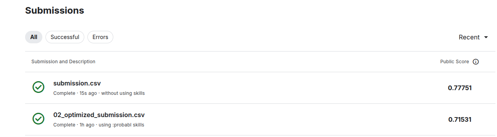

# Fragola SDK + Probabl Skills Demo

This project is a brief comparison between two agents created with [fragolaSDK](https://github.com/shadokan87/fragolaSDK) to solve the [Kaggle Titanic competition](https://www.kaggle.com/competitions/titanic/overview): one run without skills, and one run with skills from [probabl-ai/skills](https://github.com/probabl-ai/skills.git).

The two outputs are collected in:

- [titanic_no_skills](./titanic_no_skills)
- [titanic_with_skills](./titanic_with_skills)

The full conversations are available in both JSON and Markdown form:

- No skills: [conversation_JSON.json](./titanic_no_skills/conversation_JSON.json) and [conversation_JSON_MARDOWN_CONVERTED.md](./titanic_no_skills/conversation_JSON_MARDOWN_CONVERTED.md)
- With skills: [conversation_JSON.json](./titanic_with_skills/conversation_JSON.json) and [conversation_JSON_MARDOWN_CONVERTED.md](./titanic_with_skills/conversation_JSON_MARDOWN_CONVERTED.md)

The Markdown versions can be read directly in VS Code or opened in a live preview tool such as [Markdown Live Preview](https://markdownlivepreview.com/).

The main difference is process quality. The `with skills` version is clearly more organized and methodical, and it documents the research through experiments, a journal, and reusable project structure. The `without skills` version is more direct and less structured.

On the result shown in `sources/submissions.png`, the submitted `without skills` file scored higher on Kaggle public score (`0.77751`) than the `with skills` submission (`0.71531`). But the documented baseline inside the `with skills` project is stronger: its Experiment 00 baseline reports `79.01%` training accuracy, while the `no skills` project describes an expected baseline around `75-78%` rather than a stronger measured baseline. Honestly, the `with skills` version also looks like it could likely reach a better Kaggle score with a few more LLM-guided iterations, because its workflow is already more systematic and better documented.